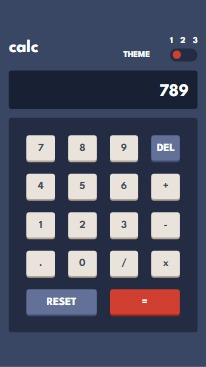
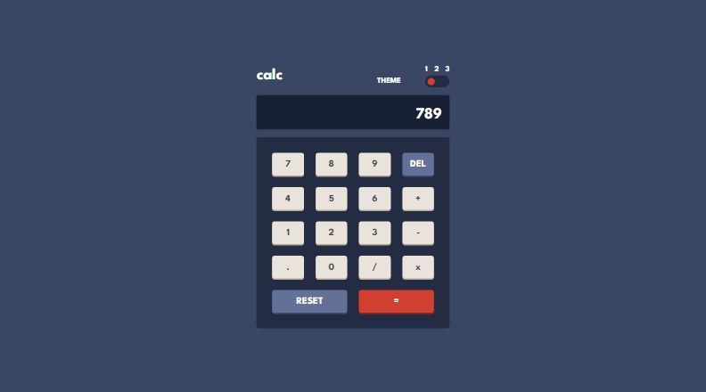
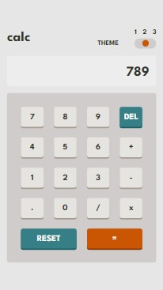
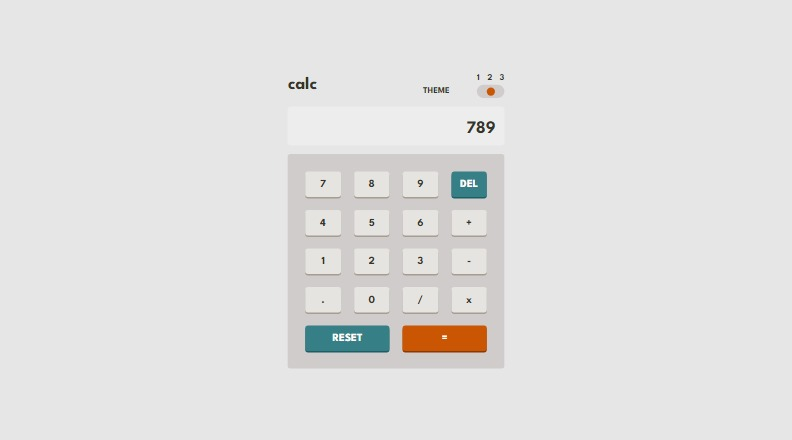
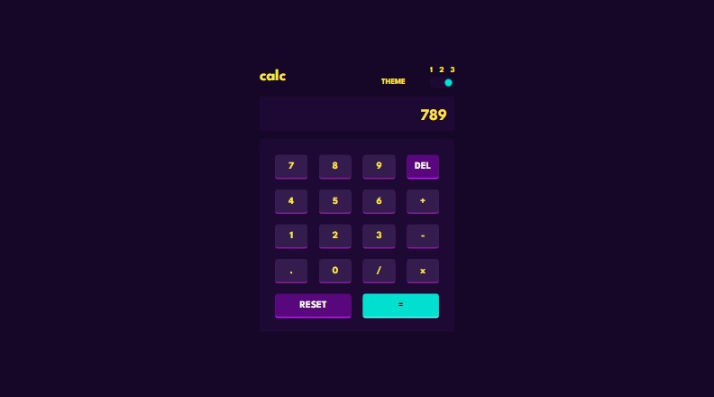

# Frontend Mentor - Calculator app solution

This is a solution to the [Calculator app challenge on Frontend Mentor](https://www.frontendmentor.io/challenges/calculator-app-9lteq5N29). Frontend Mentor challenges help you improve your coding skills by building realistic projects. 

## Table of contents

- [Overview](#overview)
  - [The challenge](#the-challenge)
  - [Screenshot](#screenshot)
  - [Links](#links)
- [My process](#my-process)
  - [Built with](#built-with)
  - [Useful resources](#useful-resources)
- [Author](#author)

## Overview

### The challenge

Users should be able to:

- See the size of the elements adjust based on their device's screen size
- Perform mathmatical operations like addition, subtraction, multiplication, and division
- Adjust the color theme based on their preference
- **Bonus**: Have their initial theme preference checked using `prefers-color-scheme` and have any additional changes saved in the browser

### Screenshot

**Theme 1** \

**Theme 2** \

**Theme 3** \

### Links

- Solution URL: [Frontend Mentor](https://your-solution-url.com)
- Live Site URL: [Vercel](https://your-live-site-url.com)

## My process

### Built with

- CSS custom properties
- Flexbox
- CSS Grid
- Mobile-first workflow
- [React](https://reactjs.org/) - JS library
- [Vite](https://vitejs.dev) - Frontend Tool

### Useful resources
- [Tutorial for React Calc](https://www.sitepoint.com/react-tutorial-build-calculator-app/) - This is an amazing article which helped me on how to create the logic behind the calculator.

## Author

- Frontend Mentor - [@joshmichael23](https://www.frontendmentor.io/profile/joshmichael23)